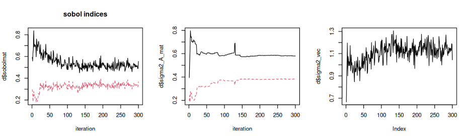

# ActiveSens Analysis repository

## Content
- notebook: analysis R notebooks
- output: saved MUSIC output
  - [output/eigf_d1_100s_300i](https://github.com/NSF-RESUME/activeSens_analysis/tree/main/output/eigf_d1_100s_300i): EIGF + D1 (100 replicates, 300 iterations)
  - [output/eigf_d2_100s_300i](https://github.com/NSF-RESUME/activeSens_analysis/tree/main/output/eigf_d2_100s_300i): EIGF + D2 (100 replicates, 300 iterations)
  - [output/vigf_d1_100s_300i](https://github.com/NSF-RESUME/activeSens_analysis/tree/main/output/vigf_d1_100s_300i): VIGF + D1 (100 replicates, 300 iterations)
  - [output/vigf_d2_100s_300i](https://github.com/NSF-RESUME/activeSens_analysis/tree/main/output/vigf_d2_100s_300i): VIGF + D2 (100 replicates, 300 iterations)

## Notes
### 1/17/25
The eigf_d1_100s_300i data can be read in and visualized via:
```
d <- readRDS("eigf_d1_100s_300i_5.0_1.rds") 
par(mfrow = c(1, 2))   
matplot(d$sobolmat, type = "l", main = 'sobol indices', xlab = "iteration")  
matplot(d$sigma2_A_mat, type = "l", xlab = "iteration")  
plot(d$sigma2_vec, type = "l", xlab = "iteration")
```

